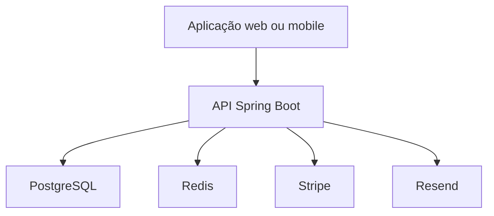

# PDV Restaurante / Bar — API

API REST desenvolvida com Spring Boot para um sistema de PDV voltado a restaurantes e bares. A aplicação permite autenticar usuários, administrar estabelecimentos e produtos, identificar mesas por cartões NFC e registrar pedidos. O projeto também possui assinatura do sistema com Stripe, recuperação de senha por e-mail e proteção distribuída do login com Redis.

## Sumário

- [Visão geral](#visão-geral)
- [Status das funcionalidades](#status-das-funcionalidades)
- [Tecnologias](#tecnologias)
- [Conceitos aplicados](#conceitos-aplicados)
- [Arquitetura resumida](#arquitetura-resumida)
- [Modelo de dados do MVP](#modelo-de-dados-do-mvp)
- [Endpoints principais](#endpoints-principais)
- [Fluxo de uso](#fluxo-de-uso)
- [Segurança e rate limiting](#segurança-e-rate-limiting)
- [Configuração do ambiente](#configuração-do-ambiente)
- [Como executar](#como-executar)
- [Roadmap](#roadmap)

## Visão geral

O projeto foi criado para centralizar operações essenciais de um restaurante ou bar em uma API preparada para integração com aplicações web e mobile.

No fluxo principal, o garçom autentica-se, lê o cartão NFC associado à mesa, consulta os produtos disponíveis e adiciona itens ao pedido em aberto. O preço unitário é registrado no momento da inclusão do item, preservando o valor praticado naquele pedido mesmo que o produto seja alterado posteriormente.

## Status das funcionalidades

### Implementado

- API REST com Java e Spring Boot 4.0.2.
- Autenticação stateless com Spring Security e JWT.
- Hash de senhas com BCrypt.
- Persistência com PostgreSQL, JPA e Hibernate.
- Cadastro e autenticação de usuários.
- Recuperação de senha com token temporário e envio de e-mail pelo Resend.
- Documentação interativa com Swagger/OpenAPI e autenticação Bearer.
- Gerenciamento de estabelecimentos, produtos, cartões NFC, mesas e pedidos.
- Associação de cartão NFC à mesa.
- Inclusão de produtos e quantidades em pedidos.
- Integração com Stripe para assinatura, Checkout, portal do cliente e webhooks.
- Rate limit distribuído no login usando Redis.
- Resposta `HTTP 429 Too Many Requests` com cabeçalho `Retry-After`.
- PostgreSQL e Redis configurados com Docker Compose.
- Configurações sensíveis carregadas por variáveis de ambiente.

### Em evolução

- Ampliação da cobertura de testes automatizados.
- Padronização global das respostas de erro.
- Revisão e expansão da documentação de todos os contratos da API.
- Preparação da infraestrutura para implantação atrás de proxy reverso ou balanceador de carga.
- Evolução das regras de autorização por perfil e estabelecimento.

### Planejado

- Fechamento de mesa e pagamento da conta do consumidor.
- Relatórios operacionais e financeiros.
- Controle de caixa.
- Impressão ou encaminhamento de pedidos para cozinha e bar.
- Notificações e processamento assíncrono de eventos.
- Métricas, logs estruturados e observabilidade.
- Pipeline de CI/CD.
- Escalabilidade horizontal com múltiplas instâncias da API.

> O pagamento da conta do restaurante permanece no roadmap. A integração atual com Stripe é usada para gerenciar a assinatura do estabelecimento no sistema.

## Tecnologias

| Área | Tecnologia |
| --- | --- |
| Linguagem | Java |
| Framework | Spring Boot 4.0.2 |
| Segurança | Spring Security, JWT e BCrypt |
| Persistência | Spring Data JPA e Hibernate |
| Banco principal | PostgreSQL 16 |
| Dados temporários | Redis 7.4 |
| Pagamentos e assinaturas | Stripe |
| E-mail transacional | Resend |
| Documentação | Swagger / OpenAPI |
| Infraestrutura local | Docker e Docker Compose |
| Build | Maven / Maven Wrapper |

## Conceitos aplicados

- Arquitetura em camadas, com separação entre controllers, services, repositories, entidades, DTOs, mappers, configurações e componentes de segurança.
- API REST e comunicação por JSON.
- Autenticação stateless com token Bearer.
- Controle de acesso por rotas protegidas e públicas.
- DTOs para separar os contratos HTTP das entidades persistidas.
- Injeção de dependências pelo Spring.
- Relacionamentos e integridade referencial no PostgreSQL.
- Registro do preço unitário no pedido para preservar o histórico comercial.
- Processamento de webhooks do Stripe.
- Tokens temporários para recuperação de senha.
- Rate limiting distribuído com contador compartilhado no Redis.
- Operação atômica no Redis para evitar condições de corrida entre requisições simultâneas.
- Expiração automática de chaves com TTL.
- Configuração externa por variáveis de ambiente.
- Containers e volumes persistentes no ambiente de desenvolvimento.

## Arquitetura resumida



- O PostgreSQL armazena os dados permanentes do negócio.
- O Redis mantém contadores temporários usados pelo rate limit.
- O Stripe gerencia assinaturas e eventos de pagamento da plataforma.
- O Resend realiza o envio dos e-mails de recuperação de senha.

## Modelo de dados do MVP

O modelo abaixo representa as entidades centrais do fluxo de atendimento. A implementação pode incluir campos auxiliares, entidades de autenticação, estabelecimentos, assinaturas e tokens que não estão detalhados neste resumo.

### `cards`

| Campo | Definição |
| --- | --- |
| `id` | UUID, chave primária |
| `uid` | Identificador NFC único e obrigatório |
| `active` | Indica se o cartão está ativo |
| `created_at` | Data de criação |

Um cartão pode estar associado a, no máximo, uma mesa por vez.

### `tables`

| Campo | Definição |
| --- | --- |
| `id` | UUID, chave primária |
| `number` | Número obrigatório da mesa |
| `card_id` | Referência única e opcional ao cartão |
| `status` | Estado da mesa |
| `created_at` | Data de criação |

Uma mesa pode possuir um cartão e vários pedidos ao longo do tempo.

### `products`

| Campo | Definição |
| --- | --- |
| `id` | UUID, chave primária |
| `name` | Nome obrigatório do produto |
| `price` | Preço com precisão decimal |
| `active` | Indica se o produto está disponível |
| `created_at` | Data de criação |

### `orders`

| Campo | Definição |
| --- | --- |
| `id` | UUID, chave primária |
| `table_id` | Referência obrigatória à mesa |
| `status` | Estado do pedido |
| `created_at` | Data de criação |

Uma mesa pode possuir somente um pedido aberto por vez.

### `order_items`

| Campo | Definição |
| --- | --- |
| `id` | UUID, chave primária |
| `order_id` | Referência obrigatória ao pedido |
| `product_id` | Referência obrigatória ao produto |
| `quantity` | Quantidade obrigatória |
| `unit_price` | Preço registrado no momento da inclusão |

### `users`

| Campo | Definição |
| --- | --- |
| `id` | UUID, chave primária |
| `name` | Nome obrigatório |
| `email` | E-mail único e obrigatório |
| `password` | Hash da senha |
| `role` | Perfil de acesso |
| `active` | Indica se o usuário está ativo |

## Endpoints principais

> A documentação Swagger da aplicação deve ser considerada a referência atual para parâmetros, corpos e respostas de cada rota.

### Autenticação

| Método | Endpoint | Descrição |
| --- | --- | --- |
| `POST` | `/auth/register` | Cadastra um usuário |
| `POST` | `/auth/login` | Autentica o usuário e retorna um JWT |
| `POST` | `/auth/forgot-password` | Solicita a recuperação de senha |
| `POST` | `/auth/reset-password` | Redefine a senha usando um token válido |

### Mesas e NFC

| Método | Endpoint | Descrição |
| --- | --- | --- |
| `GET` | `/tables/by-card/{cardUid}` | Localiza a mesa pelo NFC e retorna o pedido aberto, quando existente |

### Produtos

| Método | Endpoint | Descrição |
| --- | --- | --- |
| `GET` | `/products` | Lista os produtos ativos |

### Pedidos

| Método | Endpoint | Descrição |
| --- | --- | --- |
| `POST` | `/orders` | Cria um pedido aberto para uma mesa |
| `GET` | `/orders/{orderId}` | Consulta o pedido e seus itens |
| `POST` | `/orders/{orderId}/items` | Adiciona um produto e sua quantidade ao pedido |
| `PUT` | `/orders/{orderId}/items/{itemId}` | Atualiza a quantidade de um item |
| `DELETE` | `/orders/{orderId}/items/{itemId}` | Remove um item do pedido |

Além dessas rotas, a API contém operações relacionadas a estabelecimentos, cartões, integração com Stripe e webhooks. Consulte o Swagger para conferir os contratos expostos pela versão em execução.

## Fluxo de uso

1. O usuário realiza o login e recebe um token JWT.
2. A aplicação envia o token Bearer nas rotas protegidas.
3. O garçom lê o cartão NFC associado à mesa.
4. A API retorna a mesa e seu pedido aberto, quando existente.
5. O garçom consulta os produtos disponíveis.
6. Os itens e suas quantidades são adicionados ao pedido.
7. O pedido permanece aberto durante o atendimento.

O fechamento da conta do consumidor e os relatórios financeiros fazem parte do roadmap.

## Segurança e rate limiting

### Autenticação

- A API utiliza JWT e não mantém sessão HTTP no servidor.
- As senhas são armazenadas como hash BCrypt.
- Rotas privadas exigem o envio do token no cabeçalho:

```http
Authorization: Bearer <token>
```

### Proteção do login

O endpoint `POST /auth/login` possui rate limit distribuído por endereço IP:

- Limite padrão: 5 tentativas.
- Janela padrão: 60 segundos.
- Estado compartilhado no Redis.
- Expiração automática do contador.
- Resposta `429 Too Many Requests` quando o limite é excedido.
- Cabeçalho `Retry-After` com o tempo restante para uma nova tentativa.
- Cabeçalho `X-RateLimit-Remaining` com a quantidade de tentativas disponíveis.

Exemplo de resposta:

```json
{
  "status": 429,
  "error": "Too Many Requests",
  "message": "Muitas tentativas de login. Tente novamente em 42 segundos."
}
```

Se o Redis ficar indisponível, o filtro registra o erro e permite que o login continue. Essa estratégia de *fail-open* preserva a disponibilidade do PDV, mas deixa o endpoint temporariamente sem rate limit.

### Proxy reverso e balanceador de carga

Atualmente, o rate limit identifica o cliente com `request.getRemoteAddr()`.

O cabeçalho `X-Forwarded-For` não deve ser lido diretamente, pois pode ser falsificado por um cliente. Quando a API for implantada atrás de um proxy reverso ou balanceador confiável, será necessário configurar o Spring Boot e a infraestrutura para processar cabeçalhos encaminhados somente por proxies conhecidos.

Essa configuração fará parte da preparação para escalabilidade horizontal.

## Configuração do ambiente

As credenciais e chaves não devem ser adicionadas ao repositório. Configure-as por variáveis de ambiente conforme as propriedades utilizadas pela aplicação.

| Variável | Finalidade | Exemplo local |
| --- | --- | --- |
| `DB_URL` | URL JDBC do PostgreSQL | `jdbc:postgresql://localhost:5432/pdv` |
| `DB_USERNAME` | Usuário do PostgreSQL | `postgres` |
| `DB_PASSWORD` | Senha do PostgreSQL | `postgres` |
| `REDIS_HOST` | Host do Redis | `localhost` |
| `REDIS_PORT` | Porta do Redis | `6379` |
| `JWT_SECRET` | Chave de assinatura do JWT | Não versionar |
| `JWT_EXPIRATION` | Duração do token JWT | Definida pela aplicação |
| `STRIPE_SECRET` | Chave privada da Stripe | Não versionar |
| `WEBHOOK_STRIPE_SECRET` | Assinatura do webhook Stripe | Não versionar |
| `RESEND_API_KEY` | Chave da API de e-mail | Não versionar |
| `LOGIN_RATE_LIMIT_MAX_ATTEMPTS` | Máximo de tentativas de login | `5` |
| `LOGIN_RATE_LIMIT_WINDOW_SECONDS` | Janela do rate limit em segundos | `60` |

> Confirme os nomes exatos no `application.properties` ou no ambiente de implantação antes de publicar. Nunca inclua valores reais de segredos no README.

## Como executar

### Pré-requisitos

- Java compatível com o projeto.
- Docker e Docker Compose.
- Git.

### 1. Clone o repositório

```bash
git clone https://github.com/LucasMaciel404/pdv-api.git
cd pdv-api
```

### 2. Inicie PostgreSQL e Redis

```bash
docker compose up -d
```

Verifique os containers:

```bash
docker compose ps
```

Teste o Redis:

```bash
docker exec -it pdv-redis redis-cli ping
```

Resposta esperada:

```text
PONG
```

### 3. Configure as variáveis de ambiente

Defina as variáveis necessárias no terminal, na IDE ou no provedor de hospedagem. Para desenvolvimento local, PostgreSQL e Redis ficam disponíveis nas portas `5432` e `6379`.

### 4. Compile e teste

No Linux ou macOS:

```bash
./mvnw clean test
```

No Windows:

```powershell
.\mvnw.cmd clean test
```

### 5. Execute a API

No Linux ou macOS:

```bash
./mvnw spring-boot:run
```

No Windows:

```powershell
.\mvnw.cmd spring-boot:run
```

A API ficará disponível, por padrão, em:

```text
http://localhost:8080
```

A interface do Swagger normalmente estará disponível em:

```text
http://localhost:8080/swagger-ui/index.html
```

## Roadmap

### Curto prazo

- [ ] Revisar no Swagger todos os endpoints documentados neste README.
- [ ] Criar testes do rate limit e dos fluxos de autenticação.
- [ ] Padronizar respostas de erro.
- [ ] Ampliar validações dos DTOs.
- [ ] Documentar exemplos de requisições e respostas.

### Médio prazo

- [ ] Implementar fechamento de mesa.
- [ ] Implementar pagamento da conta do consumidor.
- [ ] Adicionar controle de caixa.
- [ ] Criar relatórios operacionais e financeiros.
- [ ] Implementar impressão ou encaminhamento de pedidos.
- [ ] Adicionar logs estruturados e métricas.

### Infraestrutura e escala

- [ ] Configurar um ambiente de produção.
- [ ] Configurar proxy reverso ou balanceador de carga.
- [ ] Confiar em cabeçalhos encaminhados apenas por proxies conhecidos.
- [ ] Executar múltiplas instâncias da API com rate limit compartilhado no Redis.
- [ ] Criar pipeline de CI/CD.
- [ ] Adicionar monitoramento e alertas.

## Objetivo do projeto

O PDV foi desenvolvido para aplicar, em um cenário real, conceitos de desenvolvimento backend, autenticação, persistência relacional, integrações externas, segurança de APIs, containers e escalabilidade. A base atual está preparada para evoluir do MVP para uma solução mais completa de operação de restaurantes e bares.
